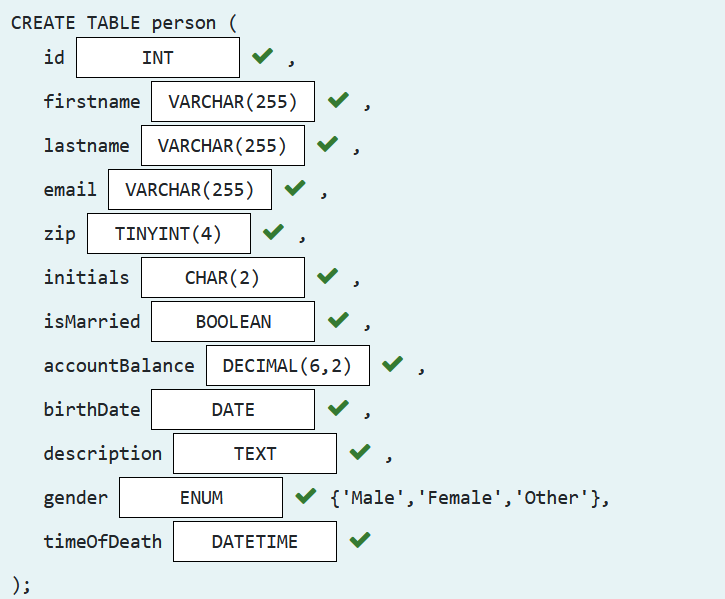
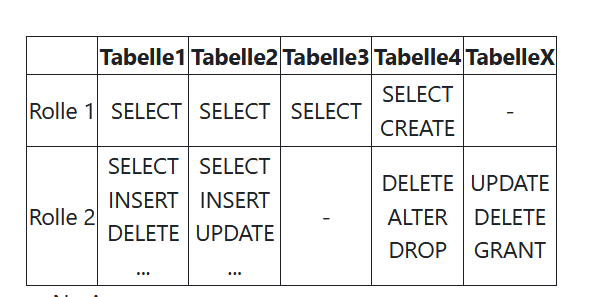
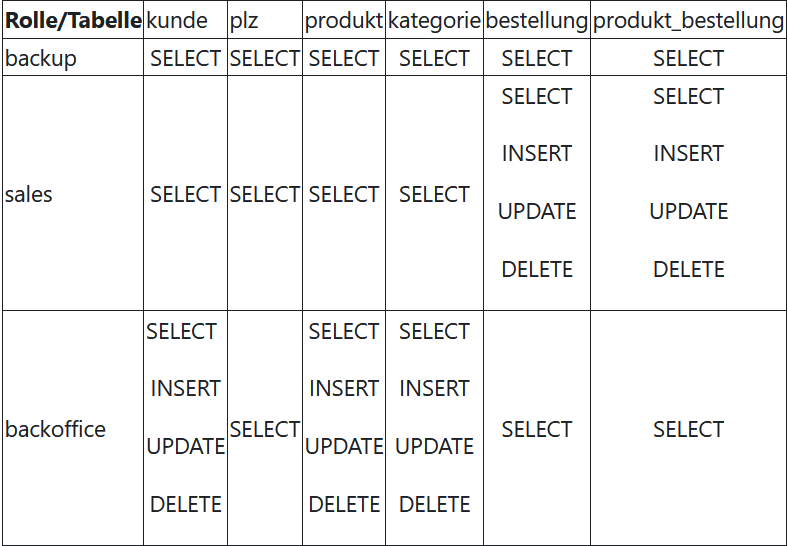

#Modul 106

### Theorie: 

1. Was ist eine Relationale Datenbank?
   - Relationale Datnebanken sind Datenbanksysteme, welche Daten in Tabellen organisiert und Beziehungen zwischen den Tabellen herstellt.
2. Drei verschiedene relationale Datenbank Management Systeme DBMS?
   - MySQL
   - Microsoft SQL Server
   - PostgreSQL
3. Handelt es sich bei SQL um eine Programmiersprache?
   - Ja, SQL ist eine Programmiersprache. Welche speziell für die Verwaltung und Abfrage von Datenbanken entwickelt wurde.
4. Was versteht man unter NoSQL Datenbank/Nennen sie drei?
   - NoSql ist eine nicht-relationale Datenbank, die entwickelt wurde, um mit großen Mengen unstrukturierter Daten effizient umzugehen.
5. Was bedeuten die Begriffe: Entität, Attribut und Tupel?
    - Entität: Eindeutiges Objekt in einem Datenbanksystem.
    - Attribut: Eigenschaft oder ein Merkmal einer Entität.
    - Tupel: Einzelne Zeile oder ein Datensatz in einer Tabelle einer relationalen Datenbank.
6. Was versteht man unter Primär- und Fremdschlüssel?
    - Primärschlüssel: Eindeutiges Identifikationsmerkmal für einen Datensatz in einer Datenbanktabelle.
    - Fremdschlüssel: Attribut, das auf den Primärschlüssel einer anderen Tabelle verweist und Beziehungen zwischen Tabellen herstellt.

### Aufgaben
####Richtiges Zuordnen von Datentypen:


Auftrag Benutzerrollen einplanen

Musterlösung_Auftrag Benutzerrollen einplanen


####Benutzer verwalten sql
- User erstellen: `CREATE USER 'meinbenutzer' IDENTIFIED BY 'passwort';`
- Berechtigungen zuweisen: `GRANT SELECT, INSERT, UPDATE ON meine_tabelle TO 'meinbenutzer';
- User löschen: `DROP USER 'meinbenutzer';`
####Beispiel von Tabellen in Sql verbinden:
```SELECT * FROM Tabelle1
RIGHT JOIN Tabelle2 ON Tabelle1.spalte = Tabelle2.spalte;```


