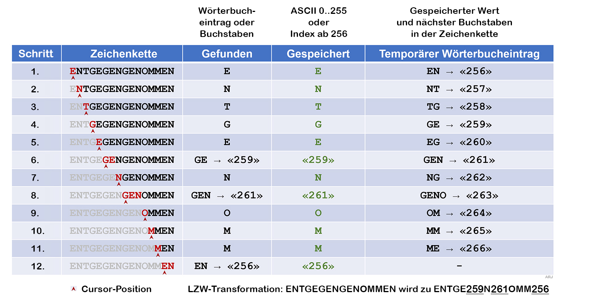
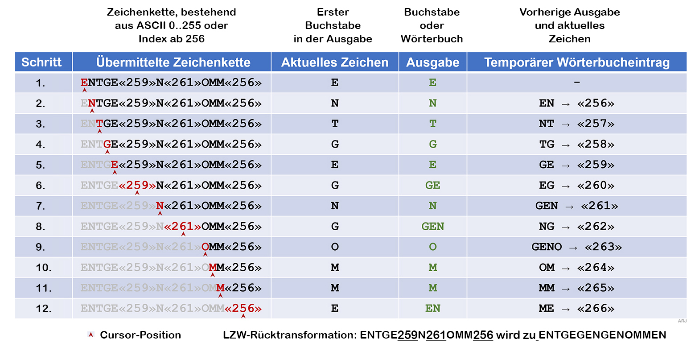

## Lexikalisches Verfahren LZW 

Ein anderer Ansatz verfolgt der Lempel-Ziv-Welch-Algorithmus: Die Idee dahinter ist, wiederkehrende binäre Muster nicht erneut zu speichern, sondern eine Referenz darauf. Es wird eine Art Wörterbuch erstellt. LZW wird häufig bei der Datenreduktion von Grafikformaten (GIF, TIFF) verwendet.
###LZW-Transformation

### LZW-Rücktransformation

